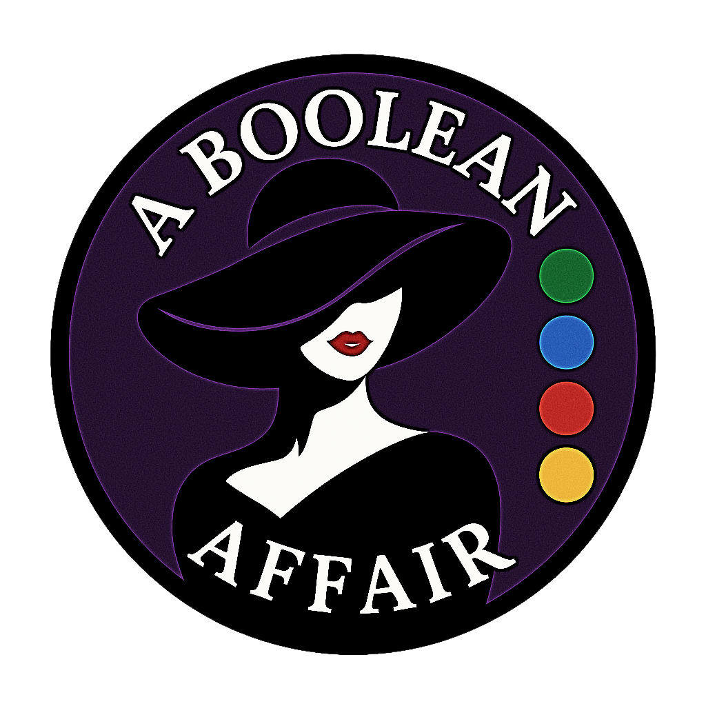

# A Boolean Affair



True. False. It’s complicated.
> This relationship is strictly conditional.

---

## Table of Contents
- [What is this?](#what-is-this)
- [Quickstart](#quickstart)
- [First Time Setup](#first-time-setup)
  - [How to Play](/docs/SETUP_AND_GUIDE.md)
- [API Reference](#api-reference)
- [Troubleshooting](#troubleshooting)

---

## What is this?
A FastAPI backend that implements the mastermind-style code‑breaking game with clean, testable logic and REST endpoints.

---

## Quickstart
If you already have `uv` and `make` installed:

```bash
uv sync          # install deps from pyproject.toml
make run         # start the API (uvicorn)

Open docs:
# Swagger UI:   http://127.0.0.1:8000/docs
# ReDoc:        http://127.0.0.1:8000/redoc
```
**No Make? Here's a fallback command to get the application started:**

    uv run uvicorn app.main:app --reload

> For a full list of scripts written for this project, see [Makefile](/Makefile)
---


## First Time Setup
> See **[SETUP_AND_GUIDE](/docs/SETUP_AND_GUIDE.md)**.md for full installation steps (uv, make, Windows/macOS notes), screenshots, and tips.

---

## **How to Play**

### Short version:
1. `POST /players/` → create player →  copy player_id. 
2. `POST /games/` → start game (pass player_id → omit other fields to use defaults) → copy game_id. 
3. `POST /games/{game_id}/guesses/` → pass game_id → send guesses like 
   ```
    {"guess_value":["1","2","3","4"]}
   ```
4. `GET /games/{game_id}` → check status, attempts_left, last_result.
>Full walkthrough (with screenshots): [SETUP_AND_GUIDE.md](/docs/SETUP_AND_GUIDE.md) and quiet → “Detailed How to Play.”

## API Reference

### Games
- `GET /games/` — Get all games
- `POST /games/` — Start a new game
- `DELETE /games/` — Delete all games
- `GET /games/{game_id}` — Get a game by ID
- `DELETE /games/{game_id}` — Delete a game by ID

### Players
- `POST /players/` — Create a player
- `GET /players/` — Get all players
- `DELETE /players/` — Delete all players
- `GET /players/{player_id}` — Get a player by ID
- `DELETE /players/{player_id}` — Delete a player by ID

### Guesses
- `POST /games/{game_id}/guesses/` — Submit a guess
- `GET /games/{game_id}/guesses/` — Get guess list
- `GET /games/{game_id}/guesses/last` — Get last guess result

---

## Troubleshooting

### IntelliJ: Missing packages after `uv sync`
Point the IDE at the project venv::
1. `IntelliJ IDEA: File > Project Structure > SDKs > Name + Existing environment > `*/a-boolean-affair/.venv/Scripts/python.exe` > then select SDK in Modules > Module SDK > Select that SDK > Apply`
2. File > Invalidate caches > Just select OK.

### `uv` and Switching Between Projects
You do not need to activate/deactive virtual environments manually.
`uv` will auto use `.venv` for the current project directory.

This warning means your shell still has an environment variable from another project:
```
VIRTUAL_ENV=/path/to/other/.venv does not match the project environment path `.venv` and will be ignored
```

**Fix**

```bash
unset VIRTUAL_ENV
uv sync
```

### Managing Dependencies
Adding dependencies to the pyproject.toml

    uv add 'requests==2.31.0'

Remove a package

    uv remove requests

For more, visit [Astral's documentation for `uv`](https://docs.astral.sh/uv/guides/projects/#creating-a-new-project)
