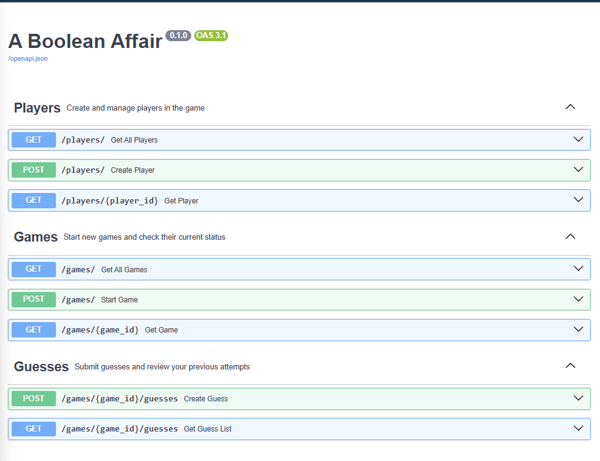
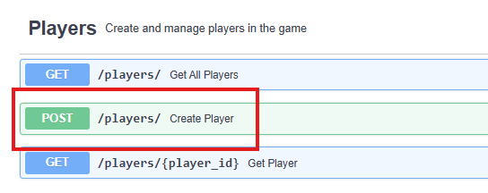
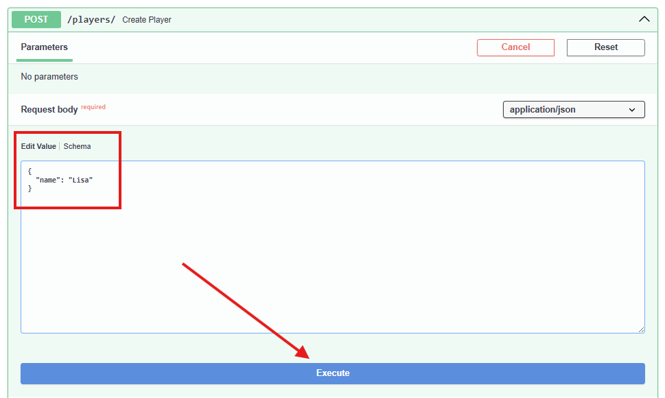
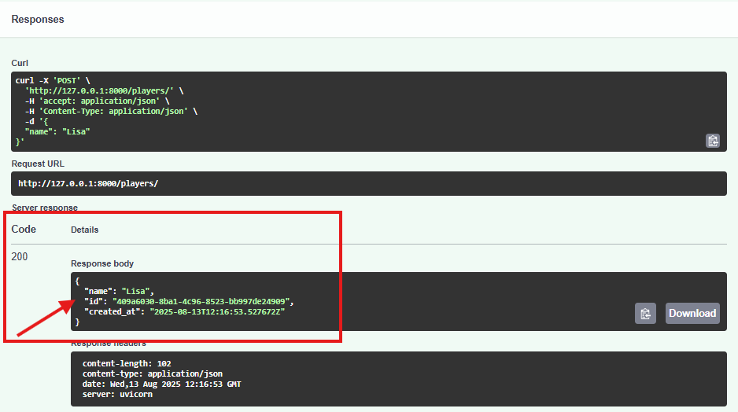
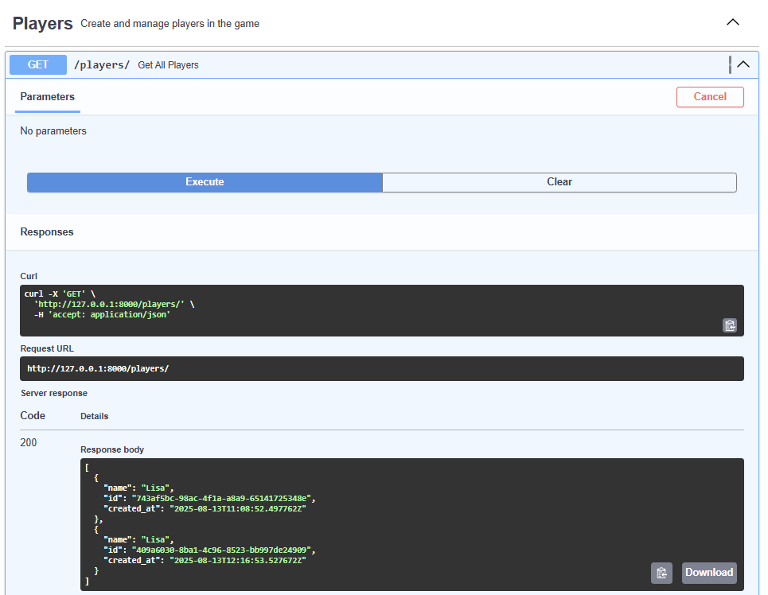
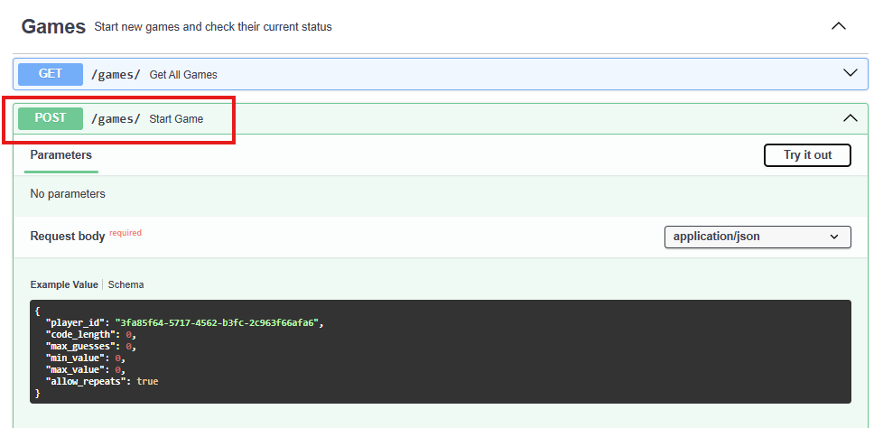

# Setup & Detailed Guide
> ⚠️ This guide assumes you’re setting up your environment for the first time. You may also need to configure your environment path variables before running the project.

## 1. Installation

### Install `uv`sd
`uv` handles Python installation, virtual environments and dependency management.

macOS and Linux

    curl -LsSf https://astral.sh/uv/install.sh | sh

**Windows (Powershell)**

    powershell -ExecutionPolicy ByPass -c "irm https://astral.sh/uv/install.ps1 | iex"

## Install `make`
> Task runner for common scripts. mac users may already have access to make. Try running step 3 to check!
> The scripts this project is using is listed in [Makefile](/Makefile)

**Mac:**
You may need Xcode Command Line Tools:

    xcode-select --install

**Windows (CMD/Powershell):**
1. **Install [Chocolatey](https://chocolatey.org/install#:~:text=Set%2DExecutionPolicy%20Bypass%20%2DScope%20Process%20%2DForce%3B%20%5BSystem.Net.ServicePointManager%5D%3A%3ASecurityProtocol%20%3D%20%5BSystem.Net.ServicePointManager%5D%3A%3ASecurityProtocol%20%2Dbor%203072%3B%20iex%20((New%2DObject%20System.Net.WebClient).DownloadString(%27https%3A//community.chocolatey.org/install.ps1%27))** (Windows package manager)
2. In PowerShell (as Administrator):

**xcode-select --install**
    ```
    choco install make
    ```
3. Verify Installation
    ```
    make --version
    ```

### Clone Repository
```
git clone <repo-url>
cd <repo-folder>
```

### Install Dependencies

    make install

This will:
* Install the correct Python version (via uv)
* Create a virtual environment
* Install all dependencies from [pyproject.toml](/pyproject.toml)

> Under the hood: this is running `uv sync`

## Run the server
* if you have make installed, you can run:
```
make run
```
> Under the hood: `uv run uvicorn app.main:app --reload`

Open your browser to link provided in your terminal. If you don't see it, feel free to use this link: [http://127.0.0.1:8000/](http://127.0.0.1:8000/)


## 2. Detailed How to Play

> From here on out, I assume your application is running. The root site looks like this:



### Step 1. Create a Player

1. In the Players section, find `POST /players/` and click to expand
   

2. Select `Try it out` and in the **Request Body**, replace the example with a name of your choosing.:
   

3. Click `Execute`.
4. In the response, copy the `id` value. You'll need this `player_id` to start the game.
   

> 💡 Tip: If you lose your player_id, you can retrieve it anytime using GET /players/ to view all players.
> 

### Step 2: Start a Game

1. In the Games section, find `POST /games/` and click `Try it out`
   

2. In the Request body, enter your `player_id` from Step 1.
    * **To use Default rules:** Only include `player_id`****

```json
{
  "player_id": "108dd449-b204-4d6d-a461-37ee8a67a759"
}
```
yields:


* **To use Custom rules: ** You can add all or omit fields like `code_length`, `max_guesses`, `min_value`, `max_value` or `allow_requests` to change how the game plays.
```json
{
   "player_id": "5bab97ff-37b1-4206-a5be-9174882a17b4",
   "code_length": 5,
   "max_guesses": 3,
   "min_value": 1,
   "max_value": 9,
   "allow_repeats": true
}
```
> In the response, note the `id` value. This is your game_id for making guesses.
>
> 💡 Tip: If you lose your player_id, you can retrieve it anytime using GET /players/ to view all players.

### Step 3: Make a Guess
1. In the Guesses section, find `/POST /guesses/` and click `Try it out`
2. In the Request body, provide your `game_id` and your guess (use the exact field names shown in the Swagger schema)
   

```json
{
   "guess_value": [
   "1","2","4","3"
   ]
}
```
3. Check the response for your result(e.g., exact / partial matches),`attempts_left`, and the game `status`


> 💡 Tip: When the `Game` status is no longer `IN_PROGRESS`, you can’t submit more guesses. Use GET /games/{game_id} to see the final state anytime.

### Step 4: Win/Lose Conditions
1. In the Games section, find `GET /games/{game_id} and click `Try it out`.
2. Enter your `game_id` from Step 2
3. Click Execute to view the current state of the game.
    * Key Fields
        * `status` -> Shows if the game is `IN_PROGRESS`, `WON`, `LOST`
        * `attempts_made` / `attempts_left` -> Tracks your progress
        * `last_guess_result` -> Shows results from your most recent games

> 💡 Tip: You can also use GET /games/ to view all active and past games.


## 3. Swagger / API Documentation

This project includes built-in interactive API docs powered by **Swagger UI**.

- Once the server is running, open: http://127.0.0.1:8000/docs
- Use the “Try it out” feature to send requests directly from your browser.
- All available endpoints are grouped by feature (Players, Games, Guesses) for easy navigation.

> 💡 **Tip:** If you prefer a cleaner, text-based view, you can use the alternative docs at:
> ```
> http://127.0.0.1:8000/redoc
> ```
